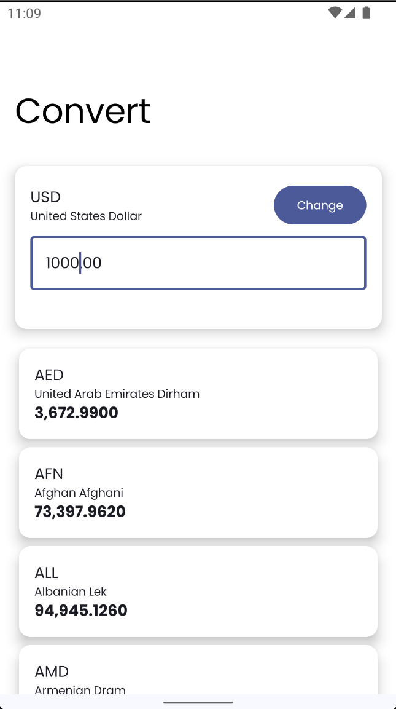
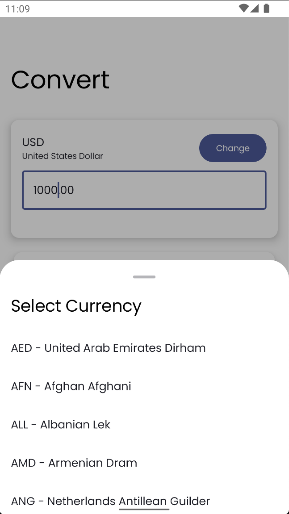

# Simple Currency Converter App
[](LICENSE)




A simple currency converter Android app built with **Jetpack Compose**, following **Clean Architecture** and **MVVM** principles. The app utilizes **Koin** for dependency injection, **Moshi** for JSON parsing, and the **OpenExchangeRates API** for real-time currency conversion.

---

## Features
- Real-time currency conversion using OpenExchangeRates API
- Modern UI with Jetpack Compose
- Clean Architecture with MVVM pattern
- Dependency Injection with Koin
- JSON parsing with Moshi

---

## Technologies Used
- **Jetpack Compose**: Modern UI toolkit for building native Android UIs.
- **Clean Architecture**: Separation of concerns with clear domain, data, and presentation layers.
- **MVVM**: Model-View-ViewModel architecture for improved maintainability and testability.
- **Koin**: Lightweight dependency injection framework.
- **Moshi**: JSON serialization/deserialization library.
- **OpenExchangeRates API**: Provides real-time exchange rate data.

---

## Getting Started

### Prerequisites
1. Install [Android Studio](https://developer.android.com/studio).
2. Ensure your project uses **Java 11** or higher.
3. Obtain an API key from [OpenExchangeRates](https://openexchangerates.org/signup/).

### Setup

1. Clone this repository:
   ```bash
   git clone https://github.com/Lucgudev/Simple-Currency-Jetpack-Compose-Clean-Architecture-MVVM.git
   cd Simple-Currency-Jetpack-Compose-Clean-Architecture-MVVM
   ```

2. Open the project in Android Studio.

3. Add your OpenExchangeRates API key:
    - Open the `build.gradle` file in the `app` module.
    - Replace `YOUR_API_KEY` with your actual API key:
      ```gradle
      buildConfigField("String", "OPEN_EXCHANGE_API_KEY", "\"YOUR_API_KEY\"")
      ```

4. Sync the project with Gradle files.

5. Run the app on an emulator or physical device.

---

## Project Structure

- **Domain Layer**
  Contains business logic and use cases.

- **Data Layer**
  Handles data sources, including APIs and local databases.

- **Presentation Layer**
  Manages the UI with Jetpack Compose and state management via ViewModel.

---

## Dependencies

The key dependencies used in this project:
- Jetpack Compose
- Koin
- Moshi
- Retrofit
- OpenExchangeRates API

For the full list, check the `build.gradle` file.

---

## License
This project is licensed under the MIT License - see the [LICENSE](LICENSE) file for details.

---

## Acknowledgments
- [OpenExchangeRates API](https://openexchangerates.org/) for providing the exchange rate data.
- Jetpack Compose, Koin, and Moshi for enabling clean and modern app development.
